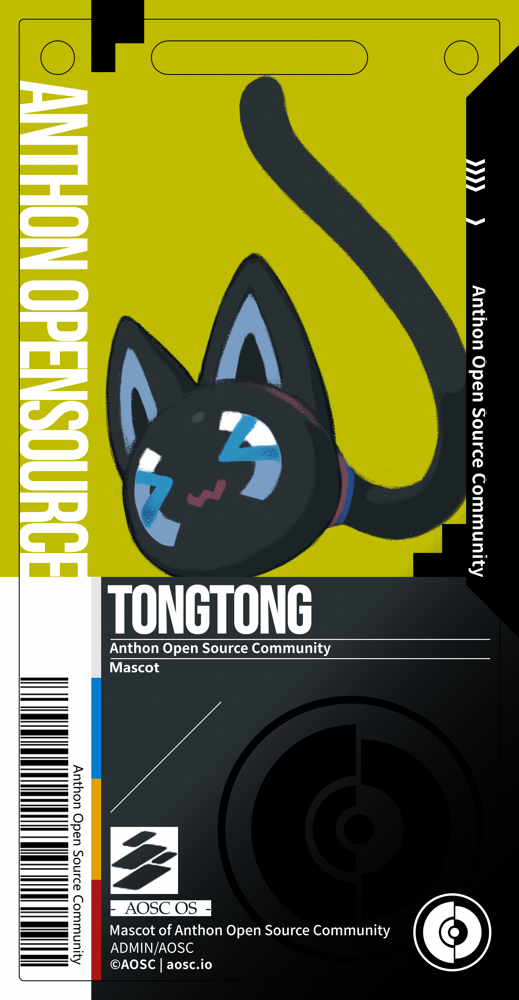

# aosc-mascots-pass

AOSC 吉祥物样式通行证

设计软件：[Krita](https://krita.org/zh-cn/)

字体（需自行获取并安装）：

- [Bebas Neue](https://github.com/dharmatype/Bebas-Neue)
- [Noto Sans CJK SC](https://github.com/notofonts/noto-cjk) / [Source Han Sans SC](https://github.com/adobe-fonts/source-han-sans)
- [TeX Gyre Pagella](https://tug.org/FontCatalogue/texgyrepagella/) / [URW Palladio](https://tug.org/FontCatalogue/urwpalladio/)
  > 注：该字体用于替代 [Palatino Linotype](https://www.myfonts.com/collections/palatino-linotype-font-zapf-alphabets/)

该系列通行证包含以下内容（辅助设计的背景均会在出品时去除）：

## 通行证

|             | 安安                                          | OMA                                         | 同同                                                  |
| ----------- | --------------------------------------------- | ------------------------------------------- | ----------------------------------------------------- |
| Sample      |  |  |  |
| Prototype   | 1                                             | 2                                           | 1                                                     |
| Version     | 1.2                                           | 1.1                                         | 1.1                                                   |
| Illustrator | 钛山 (Tyson Tan)                              | 五十根炸虾                                  | 钛山 (Tyson Tan)                                      |

## 挂绳(可选)

## License

CC BY-SA 4.0 International

©AOSC | aosc.io
